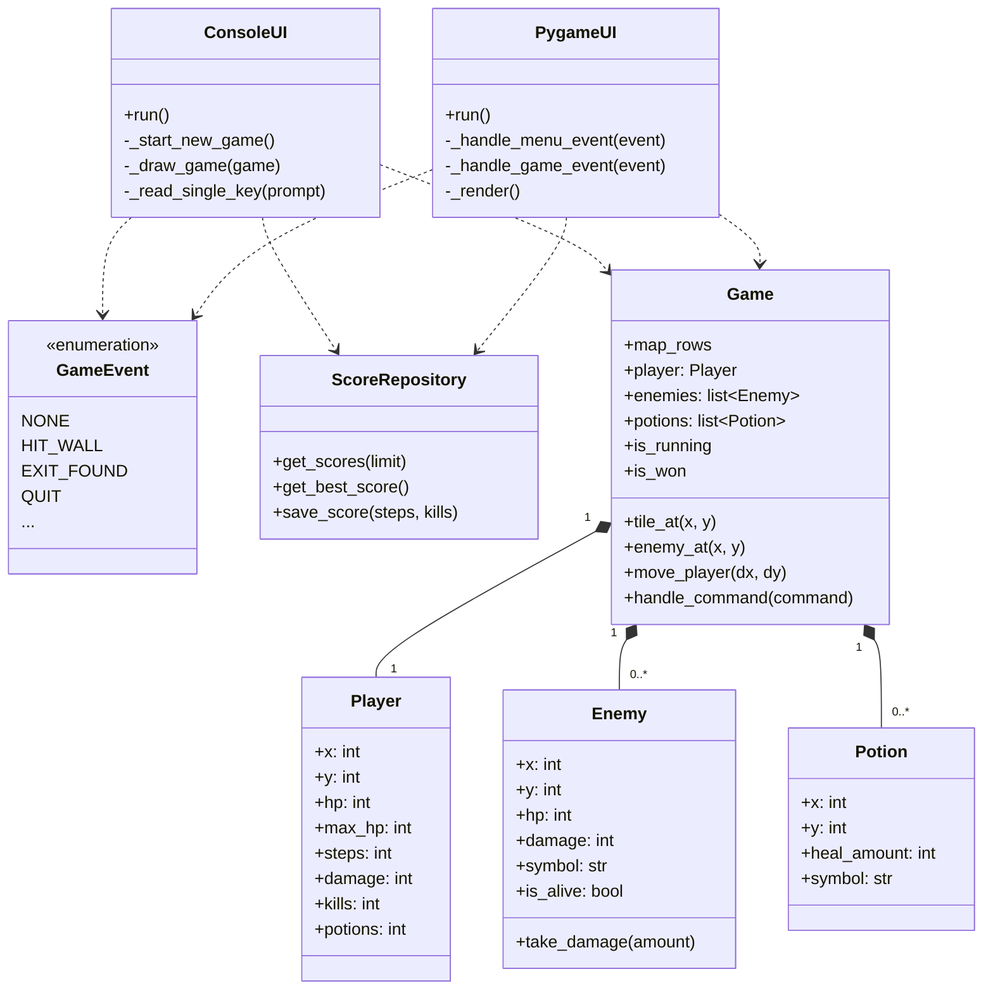

# Arkkitehtuuri

## Yleiskuvaus

Luolastopeli on vuoropohjainen dungeon crawlerien kaltainen peli, jossa pelaaja liikkuu ruudukkopohjaisessa karttaympäristössä, taistelee vihollisia vastaan ja kerää esineitä. Peli ohjelmoitu käyttäen **kerrosarkkitehtuuri

n** periaatteita, jossa sovelluslogiikka on selvästi erotettu käyttöliittymäkerroksesta.

## Pakkausrakenne

```
src/
├── dungeon_game/
│   ├── models/              # Data-mallit
│   │   ├── player.py        # Pelaaja-objekti
│   │   ├── enemy.py         # Vihollinen-objekti
│   │   └── potion.py        # Potion-esine
│   │
│   ├── repositories/        # Persistenttikerros
│   │   └── score_repository.py  # Tulosten tallennus JSON:iin
│   │
│   ├── game.py              # Pelinsääntöjen moottori
│   ├── game_map.py          # Karttadefinitio
│   ├── ui.py                # Tekstipohjainen käyttöliittymä
│   └── pygame_ui.py         # Graafinen käyttöliittymä (Pygame)
│
└── main.py                  # Pääohjelma

tests/
├── test_game_logic.py       # Pelilogiikan testit
├── test_score_repository.py # Tulostenhallinnan testit
└── ...
```

## Arkkitehtuuri

### Kerroksittainen rakenne

#### 1. **Sovelluslogiikkakerros** (`game.py`)

Sisältää pelinsääntöjä ja tilanmuutoksia:

- **Game**: Pääluokka, joka hallitsee:
  - Kartan tilaa (`map_rows`)
  - Pelaajaa (`player`) ja vihollisia (`enemies`)
  - Esineitä (`potions`)
  - Liikkumisen validointia
  - Taistelumekaniikkaa (pelaaja vs vihollinen)
  - Vuoropohjaista vihollisten AI:ta (lähelle pelaajaa → hyökkää)

- **GameEvent**: Enum-luokka, joka määrittelee kaikki pelistä tulevat tapahtumat
  - Erottaa pelilogiikan käyttöliittymästä

#### 2. **Datakerros** (`models/`)

Yksinkertaiset dataluokat:

- **Player**: Pelaajan tieto (koordinaatit, HP, askeleet, tapot, potionit)
- **Enemy**: Vihollisen tieto (koordinaatit, HP, vahinko, symboli)
- **Potion**: Esineen tieto (koordinaatit, paranemismäärä)

#### 3. **Persistenttikerros** (`repositories/`)

- **ScoreRepository**: Hallitsee tulosten tallennusta JSON-tiedostoon
  - Lukee ja kirjoittaa tulokset
  - Järjestää tulokset (vähän askeleita > paljon askeleita, paljon tappoja > vähän tappoja)
  - Ylläpitää top 10 listaa

#### 4. **Käyttöliittymäkerros** (kaksi toteutusta)

**ConsoleUI** (`ui.py`):
- Tekstipohjainen käyttöliittymä
- Lukee komennot näppäimen painalluksesta
- Piirtää kartan ASCII-merkkeinä

**PygameUI** (`pygame_ui.py`):
- Graafinen käyttöliittymä Pygamella
- Tilakone (menu → game → results → game_over)
- Piirtää kartan, entiteetit ja tilastot ruudukkoihin

Molemmat:
- Käyttävät `GameEvent`-enumia logiikasta
- Mappaavat `GameEvent` → käyttäjälle näytettävät viestit
- Kutsuvat `Game`-luokan metodeja

### Kommunikaatiovirta

```
UI (pygame_ui.py / ui.py)
    ↓ Komento (w/a/s/d/u/q)
Game.handle_command()
    ↓ Muuttaa tilaa (pelaaja, viholliset, esineet)
GameEvent (esim. ENEMY_HIT_PLAYER)
    ↓ Tapahtuma
UI (renderöi ja näyttää viestin)
```

## Tietomallit

### Game-tila

```python
Game:
  - map_rows: list[list[str]]    # Kartta ruudukkona
  - player: Player               # Pelaaja
  - enemies: list[Enemy]         # Vihölliset
  - potions: list[Potion]        # Potionit
  - is_running: bool             # Peli käynnissä?
  - is_won: bool                 # Pelaaja voitti?
```

### Tulokset (JSON)

```json
[
  {"steps": 42, "kills": 5},
  {"steps": 51, "kills": 3}
]
```

## Testattavuus

- **Pelilogiikka**: Ei riippuvainen UI:sta, joten helppo testata
  - `test_game_logic.py`: ~15 testiä liikkumiselle, taistelulle, potionien käytölle
  
- **Tallennus**: Eristetty repository-luokkaan
  - `test_score_repository.py`: ~6 testiä lukemiselle, kirjoitukselle, yhteensopivuudelle

## Luokkakaavio


