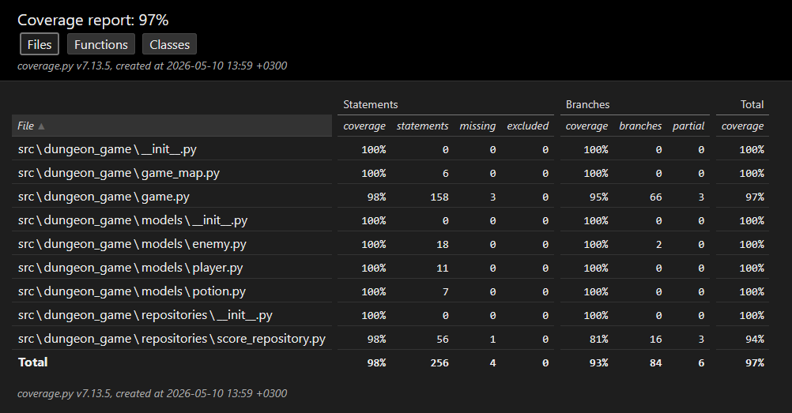

# Testausdokumentti

Testausdokumentti käsittelee Luolastopelin yksikkö-, integraatio- ja järjestelmätestauksen tuloksia sekä sovellukseen jääneitä ongelmia.

## Yksikkötestaus

### Testien määrä ja kattavuus

- **Testien yhteismäärä**: 34 testiä
- **Test framework**: pytest
- **Testit sijaitsevat**: `src/tests/`

### Testatut komponentit

#### `test_game_logic.py` (24 testiä)
Testaa pelilogiikan keskeisiä komponentteja:

- **Pelaajan liikkuminen**: 
  - Liikkuminen neljään suuntaan (W/A/S/D)
  - Seinään törmääminen
  - Kartan ulkopuolelle menemisen estäminen
  
- **Taistelumekaniikka**:
  - Pelaajan hyökkäys viholliseen
  - Vihollisen vastahyökkäys
  - Pelaajan kuolema
  - Life steal -mekaniiikka (HP palautus)
  
- **Esineiden hallinta**:
  - Juoman kerääminen
  - Juoman käyttö
  - Tilanne, jossa pelaaja yrittää juoda ilman että hänellä on juomia
  
- **Vaikeustasot**:
  - Helppo taso (1 goblin)
  - Normaali taso (1 orc + 2 goblinia)
  - Vaikea taso (10 orkkia + 6 goblinia)
  
- **Vihollisten tyypit**:
  - Goblin-tyypin luonti ja ominaisuudet
  - Orc-tyypin luonti ja ominaisuudet
  - HP ja damage-eroavaisuudet

- **Pelin päättyminen**:
  - Voittaminen (uloskäynnin saavuttaminen)
  - Häviäminen (kuolema)
  - Komennon käsittely pelin päättyessä

**Testien tila**: Kaikki testit menevät läpi

#### `test_score_repository.py` (10 testiä)
Testaa tulosten tallennusta ja hakemista:

- **Tulosten tallennus**:
  - Uuden tuloksen tallentaminen
  - JSON-tiedoston luonti
  
- **Tulosten haku**:
  - Kaikki tulokset (Top 10)
  - Tulokset vaikeustason mukaan (Easy/Normal/Hard)
  - Parhaiden tulosten järjestys
  
- **Taaksepäin yhteensopivuus**:
  - Vanhojen pelkkien kokonaislukujen muuntaminen oikeaan muotoon
  - Vanhojen dictionary-muotojen, joista puuttuu vaikeustaso, käsittely
  
- **Virheenkäsittely**:
  - Väärin muotoiltu JSON
  - Puuttuva tiedosto
  - Väärä JSON-muoto

**Testien tila**: Kaikki testit menevät läpi

### Testien ajaminen

```bash
poetry run invoke test
```

Kaikki yksikkötestit menevät läpi ilman virheitä.

Coverage-raportin voi luoda komennolla:

```bash
poetry run invoke coverage-report
```

Testikattavuus: 97%



## Integraatiotestaus

Integraatiotestaus varmistaa, että sovelluksen eri komponentit toimivat yhdessä oikein.

### Testatut integraatiot

#### Game <-> Player
- Pelaajan liikkuminen päivittää koordinaatit oikein
- Pelaajan HP muuttuu taistelussa
- Pelaajan tapot kasvavat vihollisen tappamisen jälkeen
- Life steal palauttaa HP:ta oikean määrän mukaan

#### Game <-> Enemy
- Vihollisten luonti vaikeustason mukaan
- Vihollisten sijainti kartalla
- Vihollisten AI
- Vihollisten HP vähenee hyökkäyksestä

#### Game <-> Potion
- Juoman kerääminen kartalta päivittää pelaajan inventaariota
- Juoman käyttäminen inventaariosta palauttaa HP:ta
- Juoman poistaminen kartalta keräämisen jälkeen

#### Game <-> ScoreRepository
- Pelin tuloksen tallentaminen JSON-tiedostoon
- Vaikeustason tallentaminen tuloksen kanssa
- Tuloksen haku oikeassa järjestyksessä

#### UI <-> Game (ConsoleUI ja PygameUI)
- Molemmat UI:t kutsuvat Game.handle_command() oikein
- GameEvent-enumit mapitaan käyttäjälle näytettäviksi viesteiksi
- Molemmat UI:t toimivat identtisellä pelilogiikalla
- Tulosten tallentaminen molemmissa UI:issa

### Integraatiotestauksen tulokset

Kaikki integraatiot toimivat oikein
Automatisoituja testejä tukee myös manuaalinen testaus

## Järjestelmätestaus

Järjestelmätestaus varmistaa, että sovellus toimii kokonaisuutena käyttäjän näkökulmasta.

Sovellusta on asennettu [käyttöohjeen](https://github.com/JoonaPietarinen/ot-harjoitustyo/blob/a1fda381ed88274d36d3b178392470458b943d7d/dokumentaatio/kayttoohje.md) mukaan ja sitä on testattu sekä Windows- että Linux-ympäristöissä, ja molemmissa käyttöliittymissä (console ja pygame).

Sovellusta  on testattu mm. ohjeiden mukaisella käytöllä, sekä tilanteissa, joissa tallennettuja tietoja ei ole entuudestaan, on entuudestaan tai ne ovat väärin muotoiltuja. Sovellus on toiminut odotetusti kaikissa tilanteissa, ja virhetilanteet on käsitelty asianmukaisesti.


## Sovellukseen jääneet laatuonglemat:

- Tallennettuja tuloksia katsellessa tulokset eivät tulostu vaikeustasojärjestykseen. Esim jos olisi tilanne, että pelaaja on voittanut helpon ja normaalin vaikeustason 12 askeleella, tulokset tallentuvat ja tulostuvat uutuus järjestyksessä, eivätkä esim normaali>helppo.
	- Tämä ei kuitenkaan ole mahdollista, sillä helpon voi läpäistä vain parillisella askelmäärällä, ja normaalin vain parittomalla askelmäärällä, ja vaikean parillisella askelmäärällä sekä vähintään 2 tapolla. Täten järjestys on vaikea > helppo aina, sillä tulokset järjestetään eniten tappoja > vähiten tappoja järjestykseen tilanteessa, jossa askelmäärä on sama.
