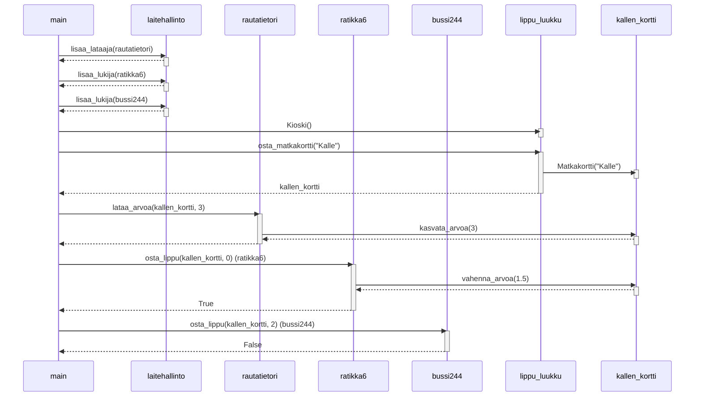

```mermaid
sequenceDiagram
    participant main
    participant HKLLaitehallinto as laitehallinto
    participant Lataajalaite as rautatietori
    participant Lukijalaite as ratikka6
    participant Lukijalaite(2) as bussi244
    participant Kioski as lippu_luukku
    participant Matkakortti as kallen_kortti

    main->>HKLLaitehallinto: lisaa_lataaja(rautatietori)
    activate HKLLaitehallinto
    HKLLaitehallinto-->>main: 
    deactivate HKLLaitehallinto

    main->>HKLLaitehallinto: lisaa_lukija(ratikka6)
    activate HKLLaitehallinto
    HKLLaitehallinto-->>main:
    deactivate HKLLaitehallinto

    main->>HKLLaitehallinto: lisaa_lukija(bussi244)
    activate HKLLaitehallinto
    HKLLaitehallinto-->>main:
    deactivate HKLLaitehallinto

    main->>Kioski: Kioski()
    activate Kioski
    deactivate Kioski

    main->>Kioski: osta_matkakortti("Kalle")
    activate Kioski
    Kioski->>Matkakortti: Matkakortti("Kalle")
    activate Matkakortti
    deactivate Matkakortti
    Kioski-->>main: kallen_kortti
    deactivate Kioski

    main->>Lataajalaite: lataa_arvoa(kallen_kortti, 3)
    activate Lataajalaite
    Lataajalaite->>Matkakortti: kasvata_arvoa(3)
    activate Matkakortti
    Matkakortti-->>Lataajalaite:
    deactivate Matkakortti
    Lataajalaite-->>main:
    deactivate Lataajalaite

    main->>Lukijalaite: osta_lippu(kallen_kortti, 0) (ratikka6)
    activate Lukijalaite
    Lukijalaite->>Matkakortti: vahenna_arvoa(1.5)
    activate Matkakortti
    Matkakortti-->>Lukijalaite:
    deactivate Matkakortti
    Lukijalaite-->>main: True
    deactivate Lukijalaite

    main->>Lukijalaite(2): osta_lippu(kallen_kortti, 2) (bussi244)
    activate Lukijalaite(2)
    Lukijalaite(2)-->>main: False
    deactivate Lukijalaite(2)
```
