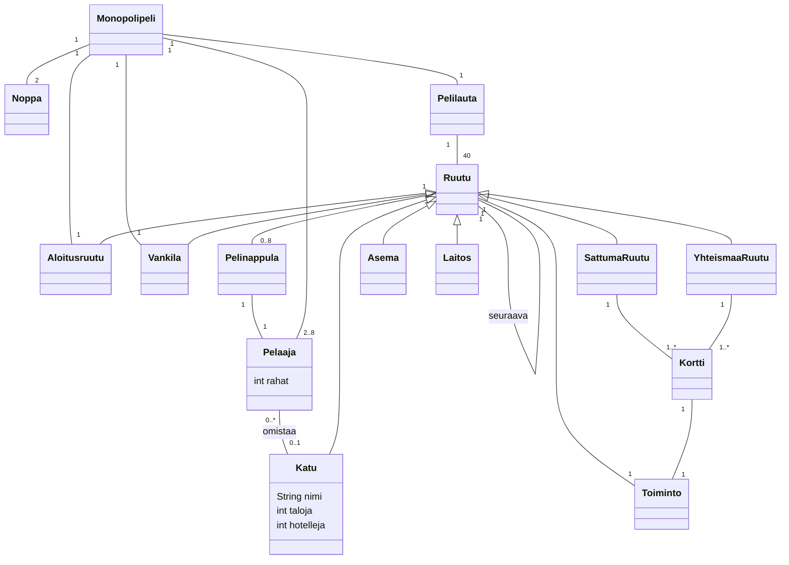

## Monopoli, alustava luokkakaavio

```mermaid
classDiagram
    Monopolipeli "1" -- "2" Noppa
    Monopolipeli "1" -- "1" Pelilauta
    Monopolipeli "1" -- "1" Aloitusruutu
    Monopolipeli "1" -- "1" Vankila
    Pelilauta "1" -- "40" Ruutu
    Ruutu "1" -- "1" Ruutu : seuraava
    Ruutu "1" -- "0..8" Pelinappula
    Ruutu "1" -- "1" Toiminto
    Pelinappula "1" -- "1" Pelaaja
    Pelaaja "2..8" -- "1" Monopolipeli
    Pelaaja "0..*" -- "0..1" Katu : omistaa

    Ruutu <|-- Aloitusruutu
    Ruutu <|-- Vankila
    Ruutu <|-- SattumaRuutu
    Ruutu <|-- YhteismaaRuutu
    Ruutu <|-- Asema
    Ruutu <|-- Laitos
    Ruutu <|-- Katu

    SattumaRuutu "1" -- "1..*" Kortti
    YhteismaaRuutu "1" -- "1..*" Kortti
    Kortti "1" -- "1" Toiminto

    class Katu {
        String nimi
        int taloja
        int hotelleja
    }

    class Pelaaja {
        int rahat
    }
```
